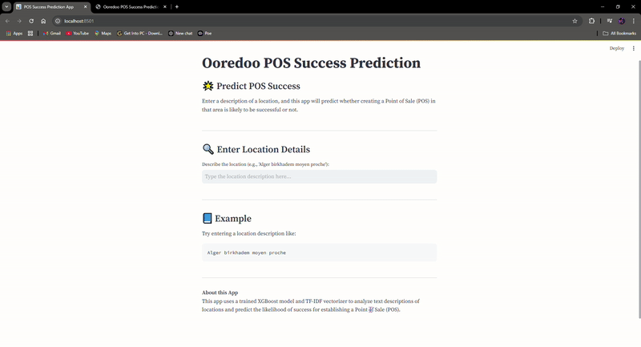

# Ooredoo POS Success Prediction

## Project Description

This project aims to predict the success of Ooredoo Points of Sale (POS) in Algeria using geographical and commercial data. The data is simulated (due to confidential and security causes) to illustrate the structure needed for effective analysis and model building.

### Objectives

1. **Data Simulation**: The data includes information such as revenue, sales, customer count, proximity to BTS (base station), and geographical coordinates of POS.
2. **Clustering**: A clustering algorithm is applied to group POS based on their characteristics and predict their success.
3. **Modeling**: Two modeling approaches are tested:
   - **Text-based Classification (NLP)**: Using geographical and commercial data to predict success via a textual model.
   - **Geographical Coordinates-based Classification**: Predicting success based on the geographical coordinates of POS.

The results are visualized through GIFs that showcase data analysis and cluster prediction.

## Results

Here are the two modeling approaches we tested:

### First Approach: Text-based Classification (NLP)

In this approach, we concatenate geographical and commercial information of POS and use it to predict the cluster to which each POS belongs. This method associates a textual description with a cluster.

### Second Approach: Geographical Coordinates-based Classification

This approach focuses solely on the geographical coordinates of POS. The user can select a point on a map, and the model’s prediction is displayed in real time.

## Conclusion

The GIFs above illustrate the two modeling approaches used to predict POS success. While the data is simulated (confidential causes), it shows how geographical and commercial data can be structured and processed for success prediction in a POS context.
